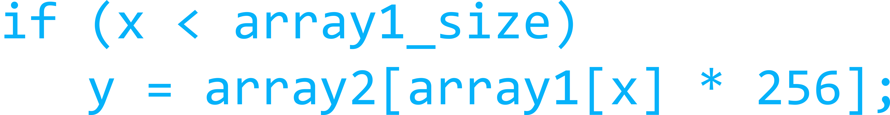

# Spectre - Proof of Concept


### What is Spectre and Meltdown? 

Meltdown and Spectre exploit critical vulnerabilities in modern processors. These hardware vulnerabilities allow programs to steal data which is currently processed on the computer. While programs are typically not permitted to read data from other programs, a malicious program can exploit Meltdown and Spectre to get hold of secrets stored in the memory of other running programs. This might include your passwords stored in a password manager or browser, your personal photos, emails, instant messages and even business-critical documents.

This code gives a brief explanation of the Spectre flaw. More information about Meltdown and Spectre can be found out [here](http://meltdownattack.com). CVE-2017-5753 and CVE-2017-5715 are the official references to Spectre. (Find out more about what CVEs are [here](https://chaitanyarahalkar.000webhostapp.com/exploits-vulnerabilities-with-introduction-to-metasploit/). This code is the proof of concept of [this](https://arxiv.org/abs/1801.01203) paper. What makes the flaw more dangerous is that it was found in computer hardware. Releasing patches and software fixes is really difficult for hardware based CVEs. 

### Etymology of Spectre 

Spectre is based on problems in speculative execution. That's how the exploit got its name. 

### Explanation of Code

In the exploit, if the compiled instructions in victim function() were executed in strict program order, the function would only read from array1[0..15] since array1 size = 16.

However, when executed speculatively, out-of-bounds reads are possible. The read memory byte() function makes several training calls to victim function() to make the branch predictor expect valid values for x, then calls
with an out-of-bounds x. 

The conditional branch mispredicts,and the ensuing speculative execution reads a secret byte using the out-of-bounds x. 
The speculative code then reads from array2[array1[x] * 256],leaking the value of array1[x] into the cache state as shown in the code block below.

</img>

To complete the attack, a simple flush+probe is used to identify which cache line in array2 was loaded, reveaing the memory contents. The attack is repeated several
times, so even if the target byte was initially uncached,the first iteration will bring it into the cache

### Running the PoC 

```bash

root@spectre$ gcc -o spectre -std=c99 spectre.c
root@spectre$ ./spectre

```
### Author

 **Chaitanya Rahalkar**

* Twitter: [@chairahalkar](https://twitter.com/chairahalkar)
* Github: [@chaitanyarahalkar](https://github.com/chaitanyarahalkar)

#### Contributing

Contributions, issues and feature requests are welcome!<br />Feel free to check [issues page](https://github.com/chaitanyarahalkar/Spectre-PoC/issues).

#### Show your support

Give a ⭐️ if this project helped you!

#### License

Copyright © 2019 [Chaitanya Rahalkar](https://github.com/chaitanyarahalkar).<br />
This project is [MIT](https://github.com/chaitanyarahalkar/Spectre-PoC/blob/master/LICENSE) licensed.
***
